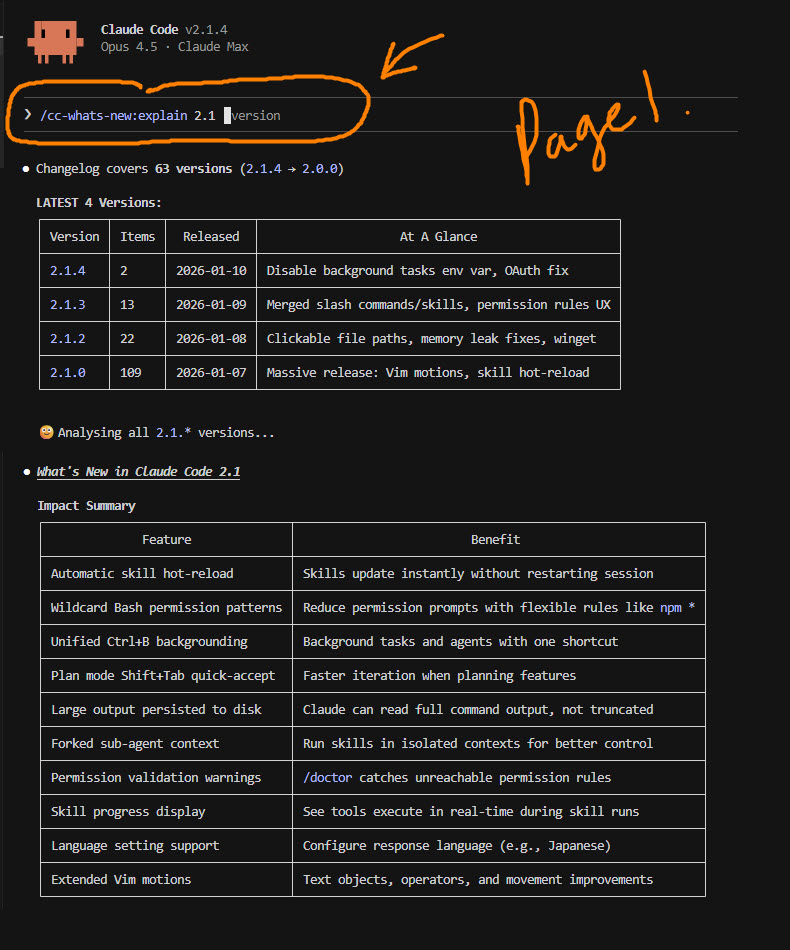
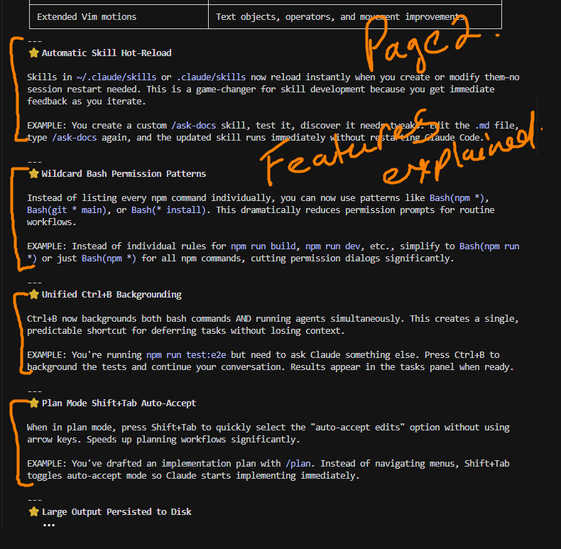
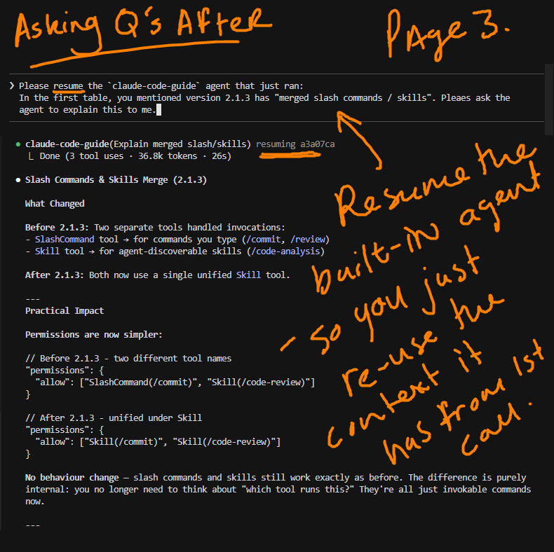

# cc-whats-new

Explains what's new in Claude Code versions with practical examples you can use immediately.

## What's Inside

| Command | Description |
|---------|-------------|
| `/cc-whats-new:explain` | Analyze changelog and explain features practically |

## Usage

```
/cc-whats-new:explain 2.1      # All 2.1.* versions
/cc-whats-new:explain 2.1.2    # Exact version only
```

## In Action

(1) Run the command — Shows changelog summary and impact table:

<div align="center">
  <a href="../../images/cc-whats-new_1.jpg" target="_blank">
    
  </a>
</div>

(2) Features explained — Each significant change gets a practical example:

<div align="center">
  <a href="../../images/cc-whats-new_2.jpg" target="_blank">
    
  </a>
</div>

(3) Ask follow-up questions — Resume the agent to dig deeper:

<div align="center">
  <a href="../../images/cc-whats-new_3.jpg" target="_blank">
    
  </a>
</div>

---

*Generated output on 2026/01/12 — output will vary.*
